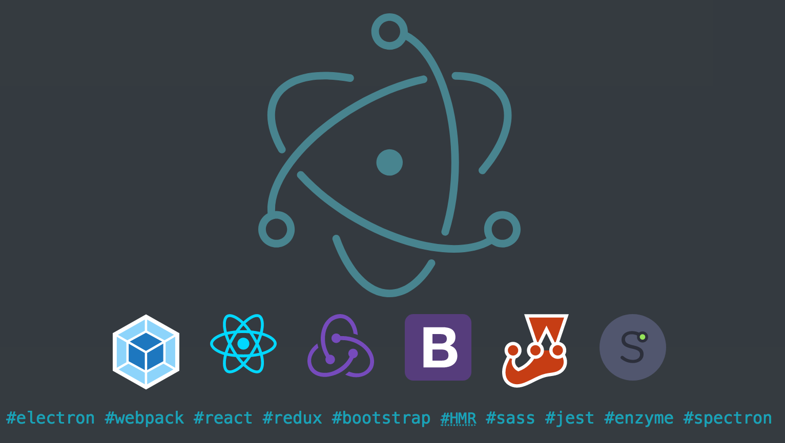

# create-electron-app

[](https://travis-ci.org/jubianchi/create-electron-app)
[](https://greenkeeper.io/)



## 🤔 Why?

-   Security best practices

-   [`create-react-app`](https://github.com/facebook/create-react-app)
-   [`electron-react-boilerplate`](https://github.com/chentsulin/electron-react-boilerplate)

If we were to talk using `create-react-app` words we could say that with `createa-electron-app` you get a pre-ejected
environment meaning you will have full-control over the configuration of each tool OOTB.

### Best practices

#### React Strict Mode

We enabled React [Strict Mode](https://reactjs.org/docs/strict-mode.html) to warn you about potential problems in your
application. We want you to be able to build the best possible app and also make any future update of dependencies easy.
When React will be ready for async rendering, you'll be happy to have every warnings already fixed and be ready to upgrade.

## 🏁 Initialize

```shell
npm init jubianchi/electron-app <target-directory>
```

## 💻 Develop

`create-electron-app` will initialize a bunch of scripts for you:

-   `start`: starts a local development environment using webpack development server.

### Environment

#### Redux

Because Electron architecture is a bit special (i.e it uses two processes, the main and the renderer) we configured Redux
to take advantage of this specificity.

The store is configured on the main process side and replicated on the renderer side. This is done using a middleware which
role is to forward actions from the main process to renderer processes and from renderer processes to the main process.
This allows us to:

-   dispatch actions from the main process and have the renderer processes updated;
-   dispatch actions from the renderer processes and have the main and other renderer processes updated.

Here is how it looks like:

```
         +-------------------------------------------------------+
         |                                                       |
         |                                                       |
+-------------------------------------------------+     +-------------------------------------------------+
|        |                                        |     |        |                                        |
|        |          MAIN PROCESS                  |     |        |       RENDERER PROCESSES               |
|        |                                        |     |        |                                        |
|  +-----+------+     +----------+     +-------+  |     |  +-----v------+     +----------+     +-------+  |
|  |            |     |          |     |       |  |     |  |            |     |          |     |       |  |
|  | DISPATCHER +-----> REDUCERS +-----> STORE |  |     |  | DISPATCHER +-----> REDUCERS +-----> STORE |  |
|  |            |     |          |     |       |  |     |  |            |     |          |     |       |  |
|  +-----^------+     +----------+     +-------+  |     |  +-----+------+     +----------+     +-------+  |
|        |                                        |     |        |                                        |
+-------------------------------------------------+     +-------------------------------------------------+
         |                                                       |
         |                                                       |
         +-------------------------------------------------------+
```

This is fairly simple, the middleware uses IPC to send actions to other processes. Because of this, actions have to be
serializable to be handled correctly by the IPC channel.

Sometimes, it might be usefull to not forward actions sent from the main or renderer processes. To do so, you can add a
`local` property with the value `true` to your actions. When the middleware finds this property (and if it is `false`) it
won't forward the action.

When a renderer process receives an action forwarder by the main process from another renderer process, a `sender` property
is added. It contains the [identifier](https://electronjs.org/docs/api/web-contents#contentsid) of the emitter process [`webContents`](https://electronjs.org/docs/api/web-contents).

### Directory structure

Once initialized, your workspace will look like this:

```
├── config
├── resources
└── src
    ├── main
    ├── renderer
    └── shared

9 directories
```

The directory structure is pretty simple and should cover all your needs:

-   [`config/`](config/) contains the configuration files used by the development tools (Webpack, Jest, ...);
-   [`resources/`](resources/) actually only contains an image used to build the MacOS DMG. You'll be able to use this directory as you like;
-   [`src/main/`](src/main/) contains the source files for the main process;
-   [`src/renderer/`](src/renderer/) contains the source files for the renderer process;
-   [`src/shared/`](src/shared/) contains the source files shared between the main and renderer process.

You are free to edit any of the files inside any directory but keep in mind that, the more you change the contents of
configuration files the harder it will be to update to future `create-electron-app` releases.

Note that the [`src/shared/`](src/shared/) directory is aliased to `@shared` to ease importing files from it.

### Adding a Chrome extension

`create-electron-app` automatically installs some developer extensions by default. Sometimes you will want to add other
extensions. Let's say you want to enable [`react-perf-devtool`](https://github.com/nitin42/react-perf-devtool).

The first thing to to is to find the extension in the
[Chrome Web Store](https://chrome.google.com/webstore/category/extensions). `react-perf-devtool` is here:
`https://chrome.google.com/webstore/detail/react-performance-devtool/fcombecpigkkfcbfaeikoeegkmkjfbfm`. Once you have
the extension's URL, find the extension's ID (the last part of the URL). In our case, it is
`fcombecpigkkfcbfaeikoeegkmkjfbfm`.

Now you can open the [`src/main/index.js`](src/main/index.js) to apply the required changes:

```diff
  try {
      installExtension([
          REACT_PERF,
          REACT_DEVELOPER_TOOLS,
          REDUX_DEVTOOLS,
+         { id: 'fcombecpigkkfcbfaeikoeegkmkjfbfm', electron: process.versions.electron },
      ])
          .then(name => console.log(`Added Extension:  ${name}`))
          .catch(err => console.log('An error occurred: ', err));
  } catch (err) {}
```

Some extensions also require you to apply changes to the renderer part. `react-perf-devtool` is one of those. Be
sure to read the extension's documentation. For the record, here is how you would enable `react-perf-devtool` on the
renderer side, in the [`src/renderer/index.js`](src/renderer/index.js) file:

```diff
  import reducers from 'shared/reducers';
+ import { registerObserver } from 'react-perf-devtool';

+ registerObserver();

  const store = createStore(reducers);
```

## 🎯 Test

`create-electron-app` will setup three [Jest](https://jestjs.io/) test suites:

-   one for the main process using [Spectron](https://electronjs.org/spectron);
-   one for the renderer processes using [Enzyme](https://airbnb.io/enzyme/);
-   one for the shared library using only Jest.

Each test suite will produce its own coverage report in the [`coverage/`](coverage/) directory.

### Scripts

You'll be able to execute the test suites using the `npm test` command but you can also run them separately:

-   `test:main` to run the main process test suite. Before you run this script, be sure to run the `build:test` script before;
-   `test:renderer` to run the renderer processes test suite;
-   `test:shared` to run the shared library test suite.

Thanks to NPM, it's possible to set additional flags when running these scripts. For example, if you are actively working
on the React part (the renderer) you can run:

```shell
npm run test:main -- --watch
```

We are adding the `--watch` flag which will be passed to Jest. Your tests will now be executed when files change.

### The `test:main` suite

As said before, this suite will let you test the code you write for the main process (i.e everything in the
[`main/`](main) directory).

To do so, it is configured to use Jest as the runner and Spectron as the testing library. Spectron will let you interact
with the actual application, find elements, windows, ...

There are mainly 2 types of test you are likely to write here:

-   unit tests to check some utility code or library you write for the main process;
-   functional tests to check the application is working correctly.

In the later case, you will have to configure, start and stop the application for each test case, `create-electrona-app`
provides some helpers to ease these tasks:

#### `application({Object}): {Promise<module:spectron.Application>}`

This helper will let you configure your application and eventually start it. It takes an object describing options as
its only argument. You will find detailed explanations on the options [here](https://github.com/electron/spectron#new-applicationoptions).

An extra option is available: `autoStart`. Its default value is `true` meaning the application will automatically be start
but you can set it to `false` if you want to start it manually

You will likely call this helper in `beforeAll` or `beforeEach`:

```js
let app;

beforeAll(async () => (app = await application()));
```

#### `stop({module:spectron.Application}): {Promise<module:spectron.Application|null>}`

During a test suite, you will sometimes have to reset application state. This helper will let you stop your application.

You will likely call this helper in `afterAll` or `afterEach`:

```js
let app;

// Start your application...

afterAll(() => stop(app));
```

### The `test:renderer` suite

This test suite is a standard Jest suite configured to test your React components.

We highly recommend you read the [official documentation](https://jestjs.io/docs/en/tutorial-react).
[Enzyme](https://airbnb.io/enzyme/) is configured with the React adapter.

**If you ever upgrade React, you will need to upgrade the Enzyme adapter in [`config/jest/setup.renderer.js`](config/jest/setup.renderer.js).**

We've also added [`redux-mock-store`](https://github.com/dmitry-zaets/redux-mock-store). It will let you
test component connected to a [Redux store](https://redux.js.org/basics/store).

### The `test:shared` suite

This suite if probably the simplest one: it only uses Jest as the runner and the [standard matchers](https://jestjs.io/docs/en/expect).

## 🚀 Package & Distribute

`create-electron-app` comes with a [default configuration](config/electron-builder.js) for
[`electron-builder`](https://github.com/electron-userland/electron-builder). It will allow you to package your
application for Window, MacOS and Linux (Debian, RHEL).

Before you package and publish your application, it is highly recommended that you test it as if it were packaged. Here
is how you would do that:

```shell
NODE_ENV=production npm run build
npm run electron
```

This will build the application in the `production` environment and run electron from the `dist/` directory (where the
compiled sources are written). If you see nothing wrong, you can go ahead and package the application:

```shell
npm run package
```

If you are using the default configuration, you should get a `packages/` directory where all the artifact will be
written: DMG, MacOS App, Deb, RPM, ...
